# Flutter Clean Architecture

A new Flutter Enterprize project structure. If you are interested to build Bigger Application then you can use this application structure.

***Screenhots of Application***

| Application Boilerplate or Structure |
| --------------------- |
| 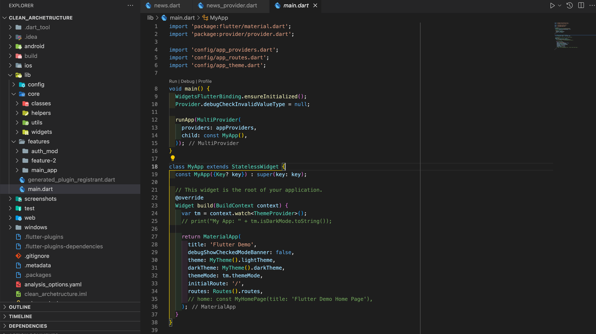 |

## Getting Started

This project is a Flutter application building frameworks. This structure to helps you to build a big multi-platform software development process.

First Rename `.env.sample` to  `.env` and put `key` value.

### API Key

Here have a news api integrated from `rapidapi.com` apis. So for the first time you need to register on that website. then search ***free news*** api from here and subscribe this api. then goto under ***Header Parameters*** then copy `X-RapidAPI-Key` value and paste this value in `.env` file as a `key` value.

**Find API Key**
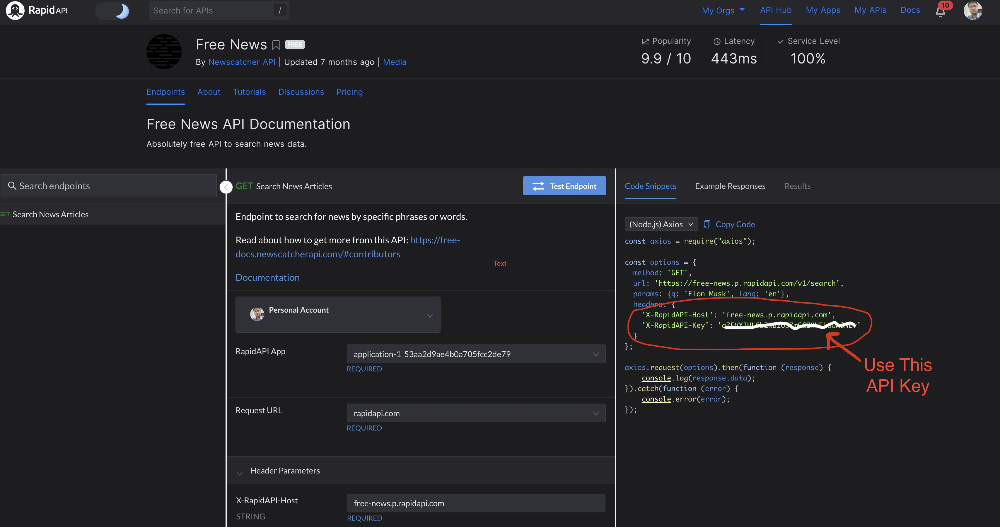

**Use API Key**
Put your Rapid API Key to `.env`

### Software Building Architecture

This Project Making for focusing to Develop Bigger project.

- Config
- Core
- Features (Modules)

### Application Screenshots Overview

| Dark Login Screen |  Light Login Screen |
| ------------------- | ----------------- |
|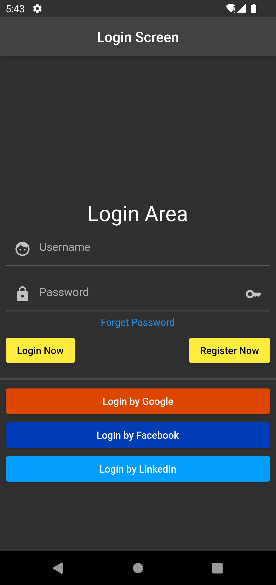|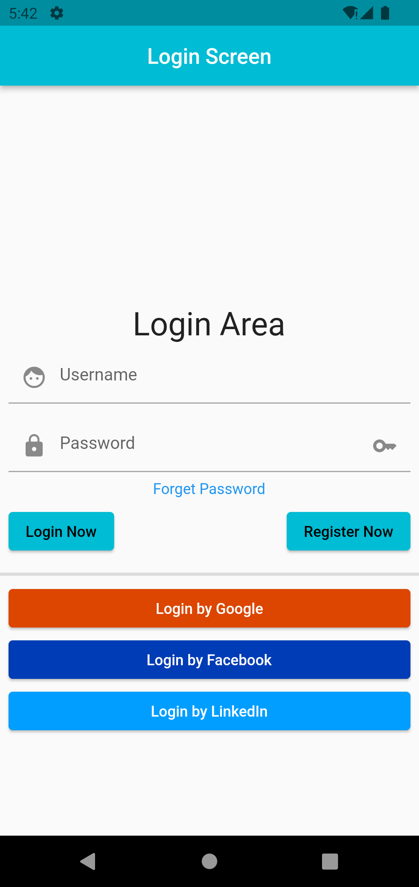 |

| Light News Screen |  Dark News Screen |
| ------------------- | ----------------- |
| 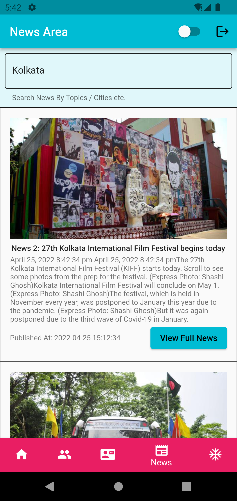 | 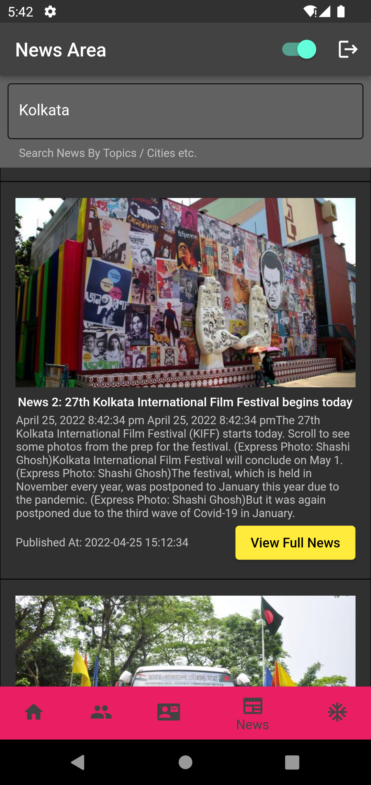 |

| Light Register Screen |  Dark Register Screen |
| ------------------- | ----------------- |
| 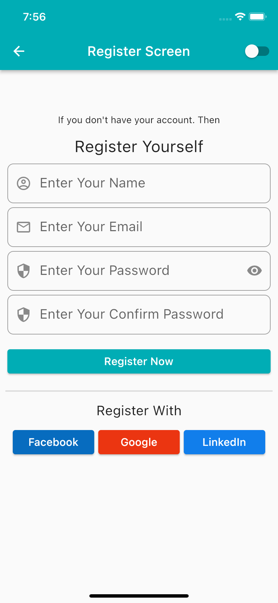 | 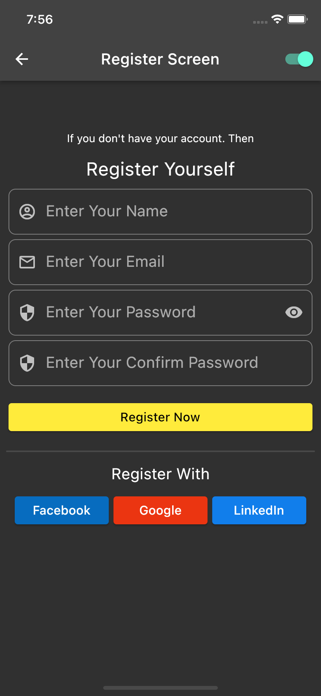 |

| Dark Profile Screen |  Light Profile Screen |
| ------------------- | ----------------- |
| 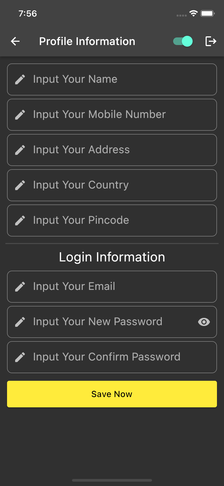 | 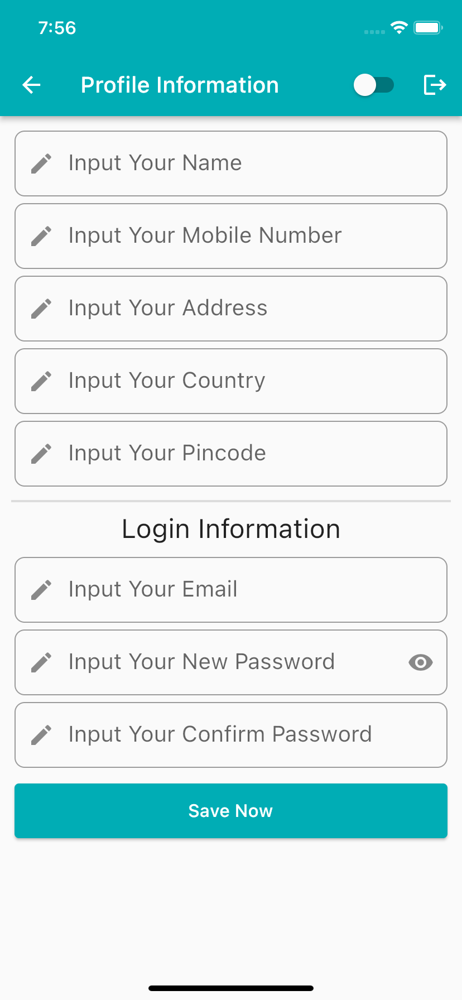 |

| Light Forget Screen |  Dark Forget Screen |
| ------------------- | ----------------- |
| 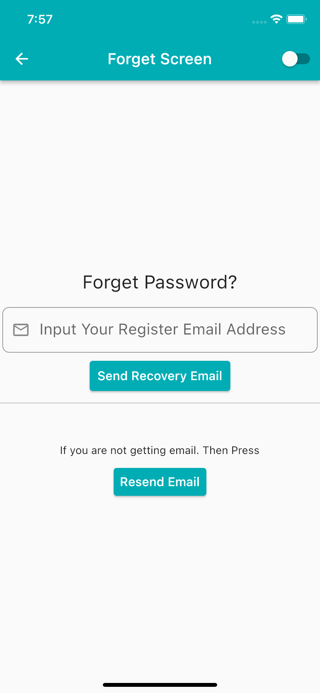 | 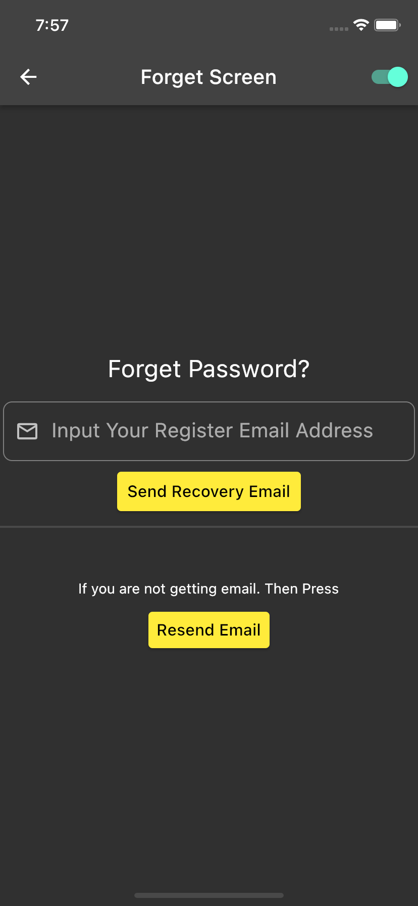 |

## If you are Beginner in Flutter then Learning about basic concepts

A few resources to get you started if this is your first Flutter project:

- [Lab: Write your first Flutter app](https://flutter.dev/docs/get-started/codelab)
- [Cookbook: Useful Flutter samples](https://flutter.dev/docs/cookbook)

For help getting started with Flutter, view our
[online documentation](https://flutter.dev/docs), which offers tutorials,
samples, guidance on mobile development, and a full API reference.
